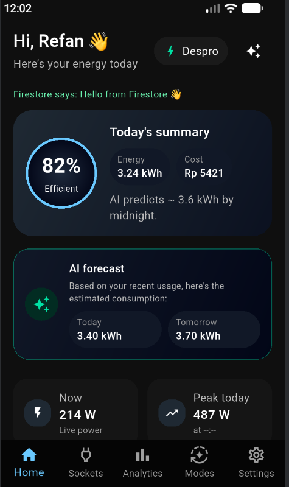
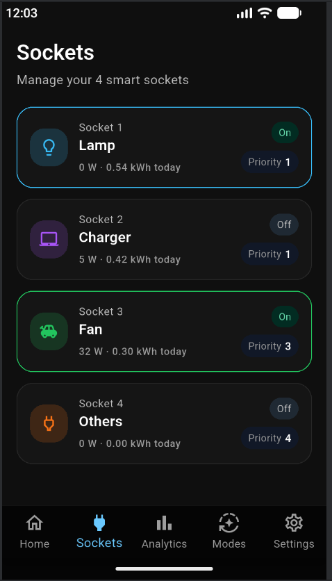
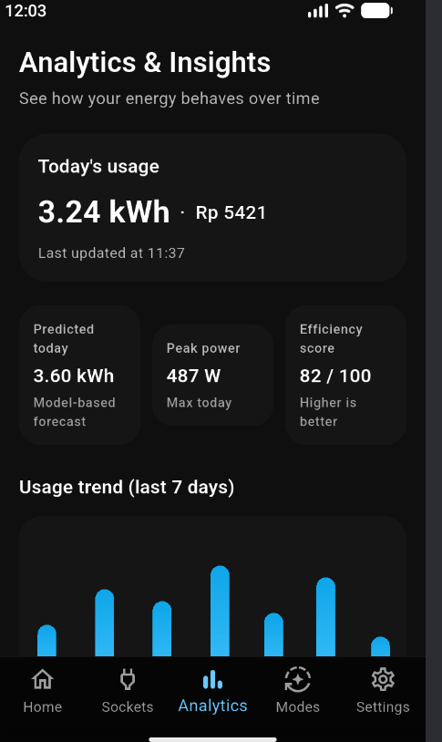
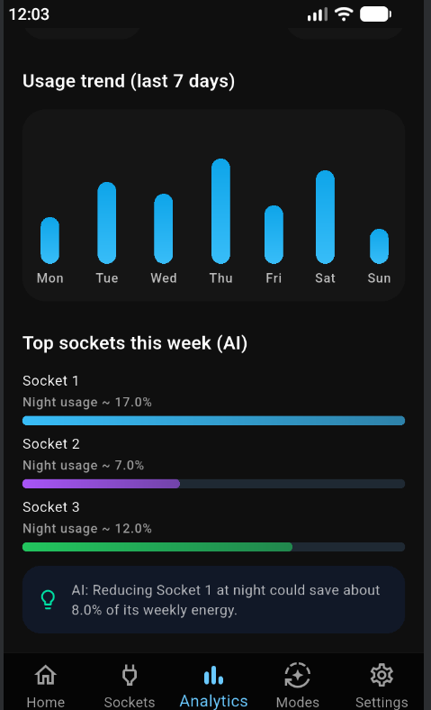
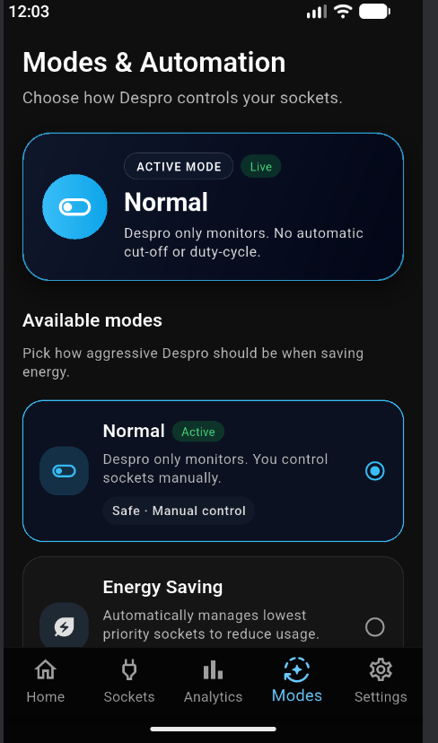
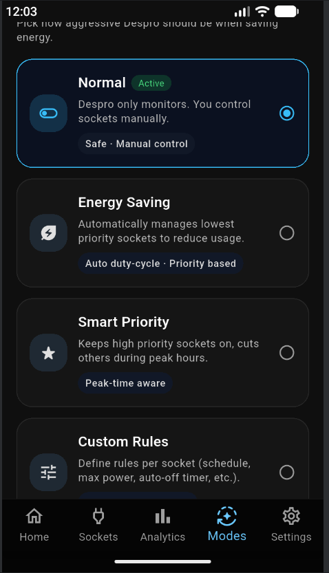
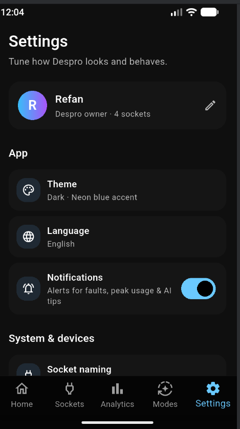

# Despro — Smart Socket Energy Monitor

A Flutter app for monitoring and controlling smart power sockets in real time, backed by Firebase Firestore. Tracks per-socket power draw, exposes on/off and mode control, and layers in basic usage analytics (daily/weekly energy prediction, night-usage ratios, abnormal-usage flags, and estimated savings per socket).

| Home | Sockets | Analytics |
|---|---|---|
|  |  |  |

| Analytics — AI tips | Modes | Modes — all options |
|---|---|---|
|  |  |  |

| Settings |
|---|
|  |

*Screenshots from a real device against a live Firebase project.*

## Features

- **Live socket list & control** (`socket_page.dart`, `socket_detail_page.dart`) — per-socket on/off state, live power draw, today's kWh, priority, and a "smart suggestions" panel per socket (night-usage %, saving estimate, abnormal-usage flag)
- **Modes** (`modes_page.dart`) — four automation modes: *Normal* (manual control only), *Energy Saving* (auto duty-cycles lowest-priority sockets), *Smart Priority* (keeps high-priority sockets on, cuts others during peak hours), and *Custom Rules* (per-socket schedule/max-power/auto-off)
- **Analytics** (`analytics_page.dart`) — today's usage/cost, a model-based kWh forecast, a 7-day usage trend chart, and an AI-ranked "top sockets this week" panel with a generated saving tip
- **AI summary card** (`home_page.dart`) — today/tomorrow predicted kWh on the Home screen
- **Settings** (`settings_page.dart`) — theme, language, notifications, socket naming, sensor calibration, network/device link
- **AI seed data** (`ai_seed.dart`) — seeds the `ai/daily_energy` and `ai/overview` Firestore documents (predicted kWh, weekly top sockets, night-usage ratios, abnormal-usage flags, saving estimates) that the Home and Analytics screens read reactively via `StreamBuilder`. This stands in for a real prediction pipeline — nothing in this repo actually trains or runs a model; a real backend job would just need to write to the same document shape.

## Stack

Flutter · Firebase Core · Cloud Firestore

## Setup

1. `flutter pub get`
2. Create a Firebase project, enable Firestore, and download your own `google-services.json` for an Android app registered as `com.refan.despro`
3. Copy `android/app/google-services.json.example` → `android/app/google-services.json` and fill in your project's values
4. In Firestore → Rules, publish rules that actually allow access — the console's default test-mode rule (`allow read, write: if request.time < timestamp.date(...)`) **expires 30 days after project creation** and silently starts rejecting every request with `permission-denied`. There's no login flow in this app, so either extend that date periodically or use `allow read, write: if true;` for a personal dev project.
5. `flutter run`, then tap the ✨ sparkle icon in the Home app bar ("Seed AI docs") to populate `ai/daily_energy` and `ai/overview` with demo prediction data — otherwise the AI cards show empty states. `analytics/daily` (today's usage/cost/forecast) isn't seeded by that button; add it by hand in the Firestore console if you want the top KPI cards populated too.

Android only — no iOS/web/desktop platform folders were generated for this project.

## Notes

The real `google-services.json` (with this project's own Firebase keys) is excluded from version control via `.gitignore`; only the redacted `.example` template is committed.
